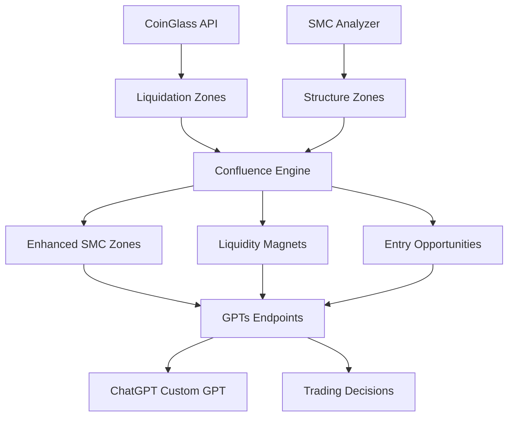

# 🏗️ COINGLASS INTEGRATION ARCHITECTURE

## Overview
Struktur lengkap integrasi CoinGlass API ke dalam sistem institutional-grade cryptocurrency trading platform kami. Framework ini memungkinkan analisis liquidation heatmaps, open interest, dan funding rates untuk meningkatkan akurasi Smart Money Concept (SMC) analysis.

---

## 📁 FILE STRUCTURE

```
core/
├── coinglass_analyzer.py              # Core CoinGlass API integration
├── enhanced_smc_coinglass_integration.py  # SMC + CoinGlass fusion
└── smc_analyzer.py                    # Existing SMC analyzer (enhanced)

api/
├── gpts_coinglass_endpoints.py        # GPTs endpoints untuk CoinGlass data
└── gpts_api_simple.py                 # Main API (akan ditambah blueprint)
```

---

## 🔧 CORE COMPONENTS

### 1. **CoinGlass Analyzer** (`core/coinglass_analyzer.py`)

**Features:**
- ✅ API key management (demo mode jika belum berlangganan)
- ✅ Rate limiting dan caching system
- ✅ Liquidation heatmap data retrieval
- ✅ Open Interest tracking
- ✅ Funding rates analysis across exchanges
- ✅ Market sentiment scoring

**Key Classes:**
```python
@dataclass
class LiquidationZone:
    price: float
    volume: float  
    side: str      # 'long' or 'short'
    strength: float # 0-100 intensity

@dataclass
class OpenInterestData:
    total_oi: float
    long_ratio: float
    short_ratio: float
    oi_change_24h: float

class CoinGlassAnalyzer:
    # Main integration class
```

### 2. **Enhanced SMC-CoinGlass Integration** (`core/enhanced_smc_coinglass_integration.py`)

**Features:**
- ✅ Confluence analysis between SMC zones and liquidation clusters
- ✅ Enhanced liquidity mapping
- ✅ Liquidity magnet identification  
- ✅ Sweep probability calculation
- ✅ Risk-reward optimization

**Key Classes:**
```python
@dataclass
class EnhancedSMCZone:
    # SMC zone enhanced with liquidation data
    liquidation_confluence: bool
    liquidation_volume: float
    confluence_score: float

@dataclass
class LiquidityMap:
    # Complete liquidity picture
    confluent_levels: List[Dict]
    liquidity_magnets: List[Dict]
    sweep_probabilities: Dict[str, float]
```

### 3. **GPTs API Endpoints** (`api/gpts_coinglass_endpoints.py`)

**Endpoints:**
- ✅ `/api/gpts/coinglass/liquidity-map` - Comprehensive liquidity analysis
- ✅ `/api/gpts/coinglass/liquidation-heatmap` - Raw liquidation data
- ✅ `/api/gpts/coinglass/market-sentiment` - Sentiment scoring
- ✅ `/api/gpts/coinglass/confluence-analysis` - SMC-liquidation confluence
- ✅ `/api/gpts/coinglass/trading-opportunities` - Actionable setups

---

## 🧠 INTELLIGENCE LAYERS

### **Layer 1: Data Acquisition**
```
CoinGlass API → Raw liquidation/OI/funding data
OKX API → Price/volume/technical data  
SMC Analyzer → Structure analysis
```

### **Layer 2: Data Processing**
```
Liquidation Zones → Price level clustering
Open Interest → Positioning analysis
SMC Zones → Structure identification
```

### **Layer 3: Confluence Analysis**
```
Price Proximity Matching → Confluence detection
Volume Weighting → Impact assessment
Risk Scoring → Safety evaluation
```

### **Layer 4: Trading Intelligence**
```
Entry Zone Generation → Setup identification
Target Selection → Liquidity magnets
Risk Management → Invalidation levels
Probability Scoring → Success likelihood
```

---

## 📊 DATA FLOW ARCHITECTURE



---

## 🎯 TRADING USE CASES

### **1. Liquidity Hunt Detection**
```python
# Identify where smart money will hunt stops
liquidity_map = integration.create_enhanced_liquidity_map("BTCUSDT")
hunt_zones = liquidity_map.liquidity_magnets

# High-probability sweep targets
for zone in hunt_zones:
    if zone['probability'] > 75:
        print(f"High-prob sweep target: ${zone['price']}")
```

### **2. Confluence Entry Timing**  
```python
# Find optimal entries at SMC + liquidation confluence
confluent_levels = liquidity_map.confluent_levels

for level in confluent_levels:
    if level['confluence_score'] > 80:
        print(f"Strong confluence at ${level['price']}")
```

### **3. Risk Management Enhancement**
```python
# Use liquidation data for stop placement
trading_ops = get_trading_opportunities("BTCUSDT")

for op in trading_ops:
    # Stop loss below liquidation cluster (safer)
    stop_loss = op['stop_loss']  # Already factors liquidation data
```

---

## 🔐 SECURITY & PERFORMANCE

### **API Key Management**
- ✅ Environment variable storage
- ✅ Graceful fallback to demo mode
- ✅ Rate limiting compliance
- ✅ Error handling for API failures

### **Caching Strategy**
```python
cache_duration = {
    'liquidation': 30,    # 30 seconds (high frequency)
    'open_interest': 60,  # 1 minute (medium frequency)  
    'funding_rates': 300  # 5 minutes (low frequency)
}
```

### **Rate Limiting**
- ✅ 100ms minimum interval between requests
- ✅ Request queue management
- ✅ Burst protection

---

## 🚀 DEPLOYMENT READINESS

### **Demo Mode (Current)**
```python
# Works immediately without API key
analyzer = CoinGlassAnalyzer()  # No API key required
demo_data = analyzer.get_liquidation_heatmap("BTCUSDT")
# Returns structured demo data for development
```

### **Production Mode (With API Key)**
```python
# Full functionality when API key available
analyzer = CoinGlassAnalyzer(api_key=os.getenv('COINGLASS_API_KEY'))
real_data = analyzer.get_liquidation_heatmap("BTCUSDT")
# Returns real-time CoinGlass data
```

### **Integration Steps When Ready**
1. **Subscribe to CoinGlass API**
2. **Add `COINGLASS_API_KEY` to Replit Secrets**
3. **System automatically switches to production mode**
4. **All endpoints become fully functional**

---

## 📈 ENHANCED ANALYSIS CAPABILITIES

### **Before CoinGlass (Current SMC Only)**
```
Analysis: SMC zones detected
Confidence: Based on technical patterns only
Risk: Structural analysis only
```

### **After CoinGlass Integration**
```
Analysis: SMC zones + liquidation confluence
Confidence: Structure + volume validation  
Risk: Multi-layer validation with liquidation data
Accuracy: Significantly improved entry timing
```

### **New Intelligence Metrics**
- **Confluence Score**: SMC + liquidation alignment (0-100)
- **Magnet Strength**: Liquidity attraction probability
- **Sweep Probability**: Directional hunt likelihood
- **Volume Confirmation**: $-weighted validation

---

## 🎯 BUSINESS VALUE

### **For Retail Traders**
- Enhanced entry timing accuracy
- Better risk management through liquidation awareness
- Professional-grade analysis tools

### **For Institutional Users**  
- Liquidity impact assessment
- Advanced risk management
- Competitive intelligence on market positioning

### **For ChatGPT Custom GPT**
- Rich trading context
- Actionable recommendations
- Real-time market structure updates

---

## 🔄 NEXT STEPS INTEGRATION PLAN

### **Phase 1: Structure Ready** ✅ COMPLETED
- Core classes and framework implemented
- GPTs endpoints structured
- Demo mode functional

### **Phase 2: API Integration** (When Ready)
- Add CoinGlass API key to secrets
- Test production endpoints
- Validate data accuracy

### **Phase 3: Enhancement** (Future)
- Machine learning on confluence patterns
- Historical backtesting integration
- Advanced alerting system

---

**STATUS**: 🟢 **READY FOR API KEY INTEGRATION**

Struktur lengkap sudah siap. Tinggal menambahkan API key CoinGlass ke Replit Secrets dan sistem akan otomatis menggunakan data real-time untuk analisis institutional-grade yang lebih akurat.